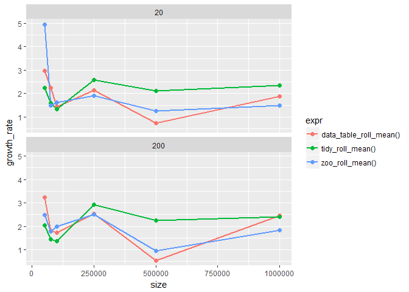
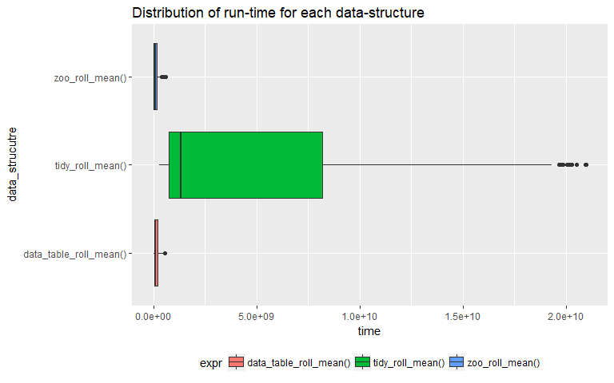
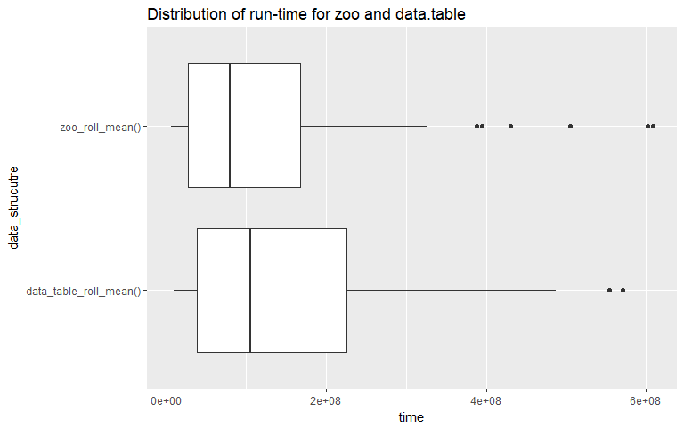
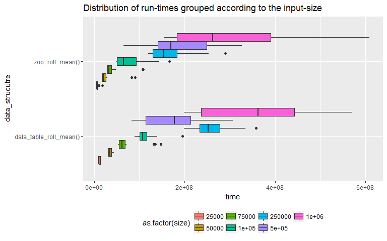
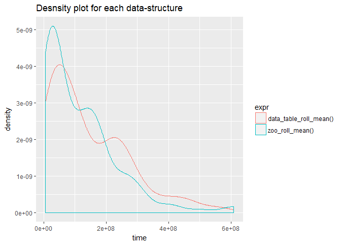

Empirical analysis of time series data-structures in R
================
Suhas Hegde
April 22, 2018

Introduction
------------

It is easy to analyze algorithms implemented in object-oriented programming languages where the algorithm would be accessible by default. Whereas in functional programming it is not always possible to access or know the algorithm hidden under the implementation of a function. Since functions can have multiple dependencies it is very hard to pin point the implementation type. So, it becomes necessary that we measure the run-time empirically by means of bench-marking the function for various input sizes. Then we can conduct statistical tests in-order to compare two or more algorithms in terms of measures such as performance(run-time) space efficiency(memory usage) etc. This method has its drawbacks since run-times are dependent on the operating system and the hardware. But one of the advantages is that for a large enough randomly drawn samples the statistical tests should hold true irrespective of the hardware limitations.

The following R implementations of some popular algorithms illustrate the predicate for this paper.

#### Factorial of a number

Factorial of a number can be found using recursive algorithm as well as using the "factorial" function that is readily available in R.

``` r
# Recursive factorial 

rec_factorial <- function(n){
  if(n == 0){
    return(1)
  }else{
    return(n*rec_factorial(n-1))
  }
}

rec_factorial(100)
```

    ## [1] 9.332622e+157

``` r
# R's native "factorial" function

factorial(100)
```

    ## [1] 9.332622e+157

The implementation of the "factorial" function is hidden behind the environment from which it is being called and hence it is not readily accessible.

``` r
# Looking at the implementation of factorial it gives some information regarding the environment and the implementation. But since it has other dependecies such as the function "gamma" we cannot really figure out what's happening at a lower level. 
body(factorial)
```

    ## gamma(x + 1)

#### Cumulative sums of a range of numbers

Finding the cumulative sum of a number involves adding all the numbers before that number in the given series.

``` r
# cumsum using a loop
for_loop_cumsum <- function(x){
  n <- 1:x
  s <- 0
  for(i in 1:length(n)){
    s <- s+n[i]
    print(s)
  }
}
for_loop_cumsum(5)
```

    ## [1] 1
    ## [1] 3
    ## [1] 6
    ## [1] 10
    ## [1] 15

``` r
# using the built in function that uses vectorization 
cumsum(1:5)
```

    ## [1]  1  3  6 10 15

One thing to note while programming in functional languages is that in most cases built-in vectorized functions are better than naive implementation of an algorithm.

    microbenchmark(for_loop_cumsum(1000), times = 100)
    microbenchmark(cumsum(1:1000), times = 100)

    ## Unit: microseconds
    ##                   expr    min     lq     mean median     uq     max neval
    ##  for_loop_cumsum(1000) 35.756 36.056 60.23852 36.057 36.357 2440.41   100

    ## Unit: microseconds
    ##            expr   min    lq   mean median    uq   max neval
    ##  cumsum(1:1000) 1.803 1.803 1.9445  1.803 2.104 4.508   100

As we can see from the above illustration the built in "cum-sum" is way faster than our own implementation of the cumulative sum function. Thus it becomes a necessity that we look beyond the traditional theoretical analysis of an algorithm in cases of functional languages. That is where the analysis of run-time and bench-marking come in handy.

"Time-series"" and implementaion of time-series in R
----------------------------------------------------

[R-language](https://www.r-project.org/about.html) is a functional programming language that is heavily used by the data-science and statistical communities. It has the highest number of implementations of various statistical measures that are clubbed together in well-defined packages. "Time series" data is a special type of data where the data has a time dependency along with other dependencies. Time series data structures are a special class of "named" vectors(arrays for those who come from JAVA) that hold information regarding the time component in a time-series. R has various implementations of time-series such as, [xts](https://github.com/joshuaulrich/xts), [zoo](https://cran.r-project.org/web/packages/zoo/zoo.pdf), [TTR](https://github.com/joshuaulrich/TTR) etc. One of the drawbacks of using these age-old implementations is that they don’t play well with other data-structures such as the [data-frames](http://stat.ethz.ch/R-manual/R-devel/library/base/html/data.frame.html) (SQL table like data-structures). So, if there is any time-series data involved during data-analysis it must be converted from data-frame to time-series and vice-versa many times during the analysis. This adds overhead and requires more time to run an analysis. So, to counter this there is a growing effort within the R-community to create frameworks that work for almost all types of data. One is the ["data.table"](https://github.com/Rdatatable/data.table) framework that focuses on in-place manipulation of data, thus increasing both the time and space efficiency of various data transformation tasks. The second is the ["tidyverse"](https://www.tidyverse.org/) framework that focuses on both the efficiency in-terms of speed as well as readability and conciseness of the code that is being written. This paper looks to decipher which framework to use for time-series analysis based on bench-marking a single operation (calculating moving averages) on a randomly generated time-series data-set.

### Experiment methodology

The experiment to collect the run-times is as follows,

-   Generate random time series data of varying sizes

-   Use different data-structures( [tidyquant](https://cran.r-project.org/web/packages/tidyquant/vignettes/TQ00-introduction-to-tidyquant.html),data.table and zoo) to store and calculate the moving averages

-   Enclose these data-structures in function calls

-   Run benchmark tests and collect the run-times and run statistical tests on the results

``` r
# randomly generate time-series data
size <- 10
date <- seq(ymd('2018-01-01'), by = 'days', length.out = size)
set.seed(10)
price <- abs(rnorm(size, mean = 10,sd = 2)) 

date
```

    ##  [1] "2018-01-01" "2018-01-02" "2018-01-03" "2018-01-04" "2018-01-05"
    ##  [6] "2018-01-06" "2018-01-07" "2018-01-08" "2018-01-09" "2018-01-10"

``` r
price
```

    ##  [1] 10.037492  9.631495  7.257339  8.801665 10.589090 10.779589  7.583848
    ##  [8]  9.272648  6.746655  9.487043

``` r
# use different data structures to store and calculate the moving averages
zoo_time_series <- zoo(price,date)
```

    rollmeanr(zoo_time_series, k=2, fill = NA)

``` r
# benchmark and collect run-times 
microbenchmark::microbenchmark(rollmeanr(zoo_time_series, k=2, fill = NA), times = 100)
```

    ## Unit: microseconds
    ##                                          expr     min       lq     mean
    ##  rollmeanr(zoo_time_series, k = 2, fill = NA) 251.193 258.8545 1532.182
    ##   median       uq      max neval
    ##  263.212 268.1685 64147.74   100

### The differences and similarities in using three packages to formulate the same result

All three data-structures and algorithms used here perform similar task. The difference lies in how they store the data and the results. For example, "zoo" uses a vector(an array) to store the data. The vector would be a named vector meaning the time component is stored as index names. The other two data-structures are much more straightforward. They directly store both the time and the numeric value corresponding to the time in two different columns of a table. The difference between data.table and tidyverse is how they manipulate data to arrive at the final result.

``` r
# we can see how zoo stores the data by looking at the structure of a zoo type object

str(zoo_time_series)
```

    ## 'zoo' series from 2018-01-01 to 2018-01-10
    ##   Data: num [1:10] 10.04 9.63 7.26 8.8 10.59 ...
    ##   Index:  Date[1:10], format: "2018-01-01" "2018-01-02" "2018-01-03" "2018-01-04" "2018-01-05" ...

``` r
# we can do the same for other two data-structures
# tidyverse - stored as a data.frame of class tbl_df
str(df)
```

    ## Classes 'tbl_df', 'tbl' and 'data.frame':    10 obs. of  2 variables:
    ##  $ date : Date, format: "2018-01-01" "2018-01-02" ...
    ##  $ price: num  10.04 9.63 7.26 8.8 10.59 ...

``` r
# data.table - stored as a data.frame of class data.table
str(dt)
```

    ## Classes 'data.table' and 'data.frame':   10 obs. of  2 variables:
    ##  $ date : Date, format: "2018-01-01" "2018-01-02" ...
    ##  $ price: num  10.04 9.63 7.26 8.8 10.59 ...
    ##  - attr(*, ".internal.selfref")=<externalptr>

### Analysis -

#### Growth Rate -

The first thing to look here is the local-order of growth, meaning the growth rate for successive run-times. How the curve for t2/t1 changes over time is interesting since we are basically plotting the slopes instead of actual run-times.



After looking at the plot we can clearly say that the rolling\_period (20,200) has no effect on the run-time, since plots for both rolling periods look similar. It is also evident as that for larger sized inputs growth rates are more or less constant.

#### Statistical tests on Runtimes -

One of the main tools used during empirical analysis are various statistical tests to determine the differences between samples. Here we are going to test whether are not a data-structure has a higher run time compared to the other two.



Box-plots are tools used to compare distributions of various groups. From the above box-plot it is evident that using "tidyverse" to calculate rolling means is not efficient compared to the other two. The mean time period required by the "tidyverse" method is a lot higher than the other two. So from here on wards we can only look at the other two methods and conduct all the tests exclusively on samples from the other two.





The above two box-plots illustrate how the distributions vary for the two methods (zoo, data.table). It looks like overall, when we account for all input sizes "zoo" has a clear performance advantage since its mean run-time is less than that of the "data.table" (plot on the top). The next plot looks at the distributions for each input size. This is important since one of the main predicates for using empirical run-time analysis is that for "realistic" input sizes, two algorithms might differ in their performance. We can see that at input size = 500000, the mean run times for both methods are very similar. This leads to the next question, can we run a test to determine if the performance of one method is better than the other.

One of the highly used statistical test is the student's t.test. For this particular instance that may not be the most suitable test since the run-time samples have a skewed distribution thus violating the assumptions that they are normally distributed. We can confirm that by constructing a density plot for each method.



As we can we see from the above plot the distributions are right tailed and hence we cannot use student's t.test. This leads us to another test which does not depend on the normality of the distribution in question called Wilcox-test or Mann-Whitney-U test. Wilcox-test, tests whether are not a randomly drawn sample from distribution 'y' is higher than that from 'x'. Let us perform this test for each input size and see if our conclusion from the box-plot (at input size 500000, "data.table" performs better than "zoo") holds true. So our hypothesis for the tests are,

H0 -&gt; runtime\_zoo = runtime\_data.table

Ha -&gt; runtime\_zoo &lt; runtime\_data.table

The following table contains the results derived from the test.

    ## # A tibble: 7 x 6
    ##   input_size statistic     p_value method     alternative `zoo < data_tab~
    ##        <dbl>     <dbl>       <dbl> <fct>      <fct>       <lgl>           
    ## 1     25000.       34. 0.000000462 Wilcoxon ~ less        TRUE            
    ## 2     50000.       40. 0.00000144  Wilcoxon ~ less        TRUE            
    ## 3     75000.       51. 0.00000915  Wilcoxon ~ less        TRUE            
    ## 4    100000.       81. 0.000467    Wilcoxon ~ less        TRUE            
    ## 5    250000.       39. 0.00000120  Wilcoxon ~ less        TRUE            
    ## 6    500000.      220. 0.708       Wilcoxon ~ less        FALSE           
    ## 7   1000000.      138. 0.0482      Wilcoxon ~ less        TRUE

The results table holds a lot of information. We need to only concentrate on the p.value which is the measure of significance. If p.value &lt; .05, that means the we can say "zoo" performs better than "data.table" otherwise "data.table" is the better data-structure for time series. As we can from the last column, only for input size 500000 p.value is not less than .05. Otherwise for all other input sizes the results are significant thus indicating that the native time-series format "zoo" holds a clear advantage in terms of run-time performance. If we perform the same statistical test for all the input sizes, ie, the data-set as whole even then "zoo" should be better than "data.table". This can be illustrated by performing another Wilcox-test on the benchmark data.

    ## 
    ##  Wilcoxon rank sum test with continuity correction
    ## 
    ## data:  df_list$`zoo_roll_mean()`$time and df_list$`data_table_roll_mean()`$time
    ## W = 8207, p-value = 0.00937
    ## alternative hypothesis: true location shift is less than 0

As indicated by the result, the p.value is significant and hence we reject our null hypothesis. That means "x &lt; y" or in other terms, runtime\_zoo &lt; runtime\_data.table.

### Conclusion

-   "zoo", the specially built data-structure for time-series data is faster than the other two for most realistic input sizes.

-   Performance of "data.table" is comparable to that of "zoo".

We have arrived at these conclusions based on tests conducted for a single type of function that is calculating moving averages. There are n number of time-series statistics that need to be calculated on any given data. We haven't even looked at fitting time-series models on data held in these data-structures. All these results may not hold true for those cases. Also, the choice of a data-structure may also be due to the ease of usage rather than performance alone.

#### References

-   ["Analysis of Algorithms"](https://algs4.cs.princeton.edu/lectures/14AnalysisOfAlgorithms.pdf), ROBERT SEDGEWICK and KEVIN WAYNE, Princeton.edu

-   ["Empirical Analysis of Algorithms"](https://www.ics.uci.edu/~brgallar/week8_3.html), RICHARD PATTIS, UCI

-   ["Empirical Analysis of Predictive Algorithms for Collaborative Filtering"](https://www.microsoft.com/en-us/research/wp-content/uploads/2016/02/tr-98-12.pdf), John S Breese, David Heckerman and Carl Kadie, Microsoft Research

-   ["A Theoretical Runtime and Empirical Analysis of Different Alternating Variable Searches for Search-Based Testing"](http://mcminn.io/publications/c31.pdf), Joseph Kempka, Phil McMinn and Dirk Sudholt, University of Sheffield

-   ["Sorting Algorithm: An Empirical Analysis"](http://www.ijesit.com/Volume%203/Issue%202/IJESIT201402_16.pdf), Mahfooz Alam, Ayush Chugh, International Journal of Engineering Science and Innovative Technology (IJESIT)

-   ["Empirical Analysis of algorithms is easy, (or is it?)"](http://citeseerx.ist.psu.edu/viewdoc/download?doi=10.1.1.37.213&rep=rep1&type=pdf), Ian Sanders, University of the Witwatersrand

-   ["INTRODUCTION TO EMPIRICAL ALGORITHMICS"](https://pdfs.semanticscholar.org/6721/489f55f3882b81f30e8f29831464ce087f5b.pdf), Holger H. Hoos

##### R-packages

-   Achim Zeileis and Gabor Grothendieck (2005). zoo: S3 Infrastructure for Regular and Irregular Time Series. Journal of Statistical Software, 14(6), 1-27. <doi:10.18637/jss.v014.i06>

-   Matt Dowle and Arun Srinivasan (2017). data.table: Extension of `data.frame`. R package version 1.10.4-3. <https://CRAN.R-project.org/package=data.table>

-   Matt Dancho and Davis Vaughan (2018). tidyquant: Tidy Quantitative Financial Analysis. R package version 0.5.4. <https://CRAN.R-project.org/package=tidyquant>

-   Hadley Wickham (2017). tidyverse: Easily Install and Load the 'Tidyverse'. R package version 1.2.1. <https://CRAN.R-project.org/package=tidyverse>
